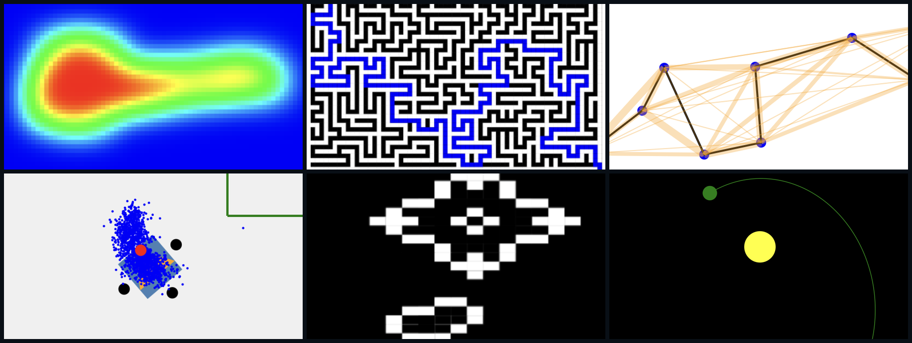

## About
Hello, and welcome to my sandbox.

Live site: https://alexandergiannak.github.io/Sandbox/

This site is a collection of small interactive simulations and algorithm demos, written in plain JavaScript and running directly in the browser.

Most of these projects share a central theme: complex, often beautiful behavior emerging from simple rules, such as the motion of planets from Newton's Law of Gravitation, the evolution of cellular automata, or the ability to recognize badly drawn MNIST digits purely from some numbers and arithmetic. 

## Projects / what's on it?
Click on the link above and explore each one instead of my telling you here. 

But if you are in a hurry, here is a quick summary:

| Project | Technique | Links |
|---|---|---|
| N-body simulator | Gravity with semi-implicit Euler integration, collision merging | [Demo](https://alexandergiannak.github.io/NBodySimulator/) · [Source](https://github.com/AlexanderGiannak/NBodySimulator) |
| Charged particles | Coulomb force plus a short-range binding term | [Demo](https://alexandergiannak.github.io/Charge-Particle-Simulator/) · [Source](https://github.com/AlexanderGiannak/Charge-Particle-Simulator) |
| Heat dispersal | Finite-difference heat equation | [Demo](https://alexandergiannak.github.io/HeatTransfer/) · [Source](https://github.com/AlexanderGiannak/HeatTransfer) |
| Wave equation | Explicit 2D damped wave equation, reflecting walls | [Demo](https://alexandergiannak.github.io/WaveSimulator/) · [Source](https://github.com/AlexanderGiannak/WaveSimulator) |
| Conway's Game of Life | B3/S23 cellular automaton | [Demo](https://alexandergiannak.github.io/Conway-Game-of-Life/) · [Source](https://github.com/AlexanderGiannak/Conway-Game-of-Life) |
| Maze | Hunt-and-kill generation, BFS shortest-path solving | [Demo](https://alexandergiannak.github.io/Maze/) · [Source](https://github.com/AlexanderGiannak/Maze) |
| Monte Carlo localization | Particle filter estimating a robot's pose from noisy sensors | [Demo](https://alexandergiannak.github.io/Monte-Carlo-Localization/) · [Source](https://github.com/AlexanderGiannak/Monte-Carlo-Localization) |
| Traveling salesman | Ant colony optimization | [Demo](https://alexandergiannak.github.io/TravelingSalesman/) · [Source](https://github.com/AlexanderGiannak/TravelingSalesman) |
| MNIST digit classifier | Neural network forward pass & backprop. written 100% by hand | [Demo](https://alexandergiannak.github.io/MNISTDigitRecognizer/) · [Source](https://github.com/AlexanderGiannak/MNISTDigitRecognizer) |
| Big arithmetic | Arbitrary-precision integers, Karatsuba multiplication | [Demo](https://alexandergiannak.github.io/Big-Arithmetic/) · [Source](https://github.com/AlexanderGiannak/Big-Arithmetic) |
| Arithmetic parser | Hand-written tokenizer, parser, and evaluator | [Demo](https://alexandergiannak.github.io/Arithmetic-Parser/) · [Source](https://github.com/AlexanderGiannak/Arithmetic-Parser) |

## How it's built
- Vanilla HTML, CSS, and JavaScript: no frameworks, libraries, or dependencies.
- Rendering uses Canvas 2D or SVG, depending on the project.
- Each project lives in its own repository with its own GitHub Pages deployment.
- This repo holds only the landing page (index.html) and its screenshots (assets/). 

## Running it
Everything is static, so clone this repo or any project repo and open index.html in a browser.

## Who am I?
I'm Alexander Giannakoulias, a CS student at the University of South Florida. Most of these projects were built several years ago and collected here in 2026. 

The original code for every project was written by hand - no AI whatsoever - for the sheer love of programming. 
